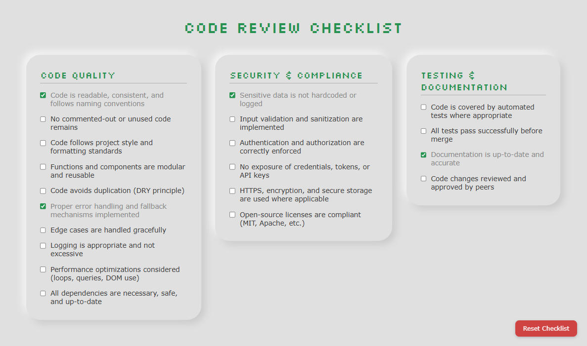

# Web-Based Code Review Checklist

## 📘 Project Overview

This project provides a simple, web-based **code review checklist tool** designed to help developers ensure code quality and compliance with industry standards.  
It allows users to track common code review items, mark them as complete, and save their progress for future reference.

---

## 🧾 Features

- Predefined checklist with **10+ common code review items** (readability, performance, security, etc.)
- Mark items as **complete/incomplete**
- **Progress saved locally** in the browser using local storage
- Clean and responsive interface for desktop browsers
- Well-commented code for learning and maintainability

---

## 🖼 Screenshot

Here’s what the application looks like:



---

## ⚙️ Setup Instructions

1. Clone the repository:
   ```bash
   git clone https://github.com/datturbomoon/code-review-checklist.git
   ```
2. Navigate to the project directory:
   ```bash
   cd code-review-checklist
   ```
3. Open `index.html` in your preferred web browser.

---

## 🛠️ Technologies Used
- HTML
- CSS
- JavaScript

---

## 🚀 How to Use
1. Open the application in your web browser.
2. Review the items and tick each one as completed.
3. Progress is automatically saved in your browser's local storage, so you can resume later.
4. Reset the checklist if you want to start fresh.

---

## ✅ Checklist Focus Areas
- Semantic and readable code
- Proper formatting and indentation
- Modular, maintainable functions
- Input validation and error handling
- Security and compliance considerations
- Browser compatibility and responsiveness
- Comments explaining complex logic